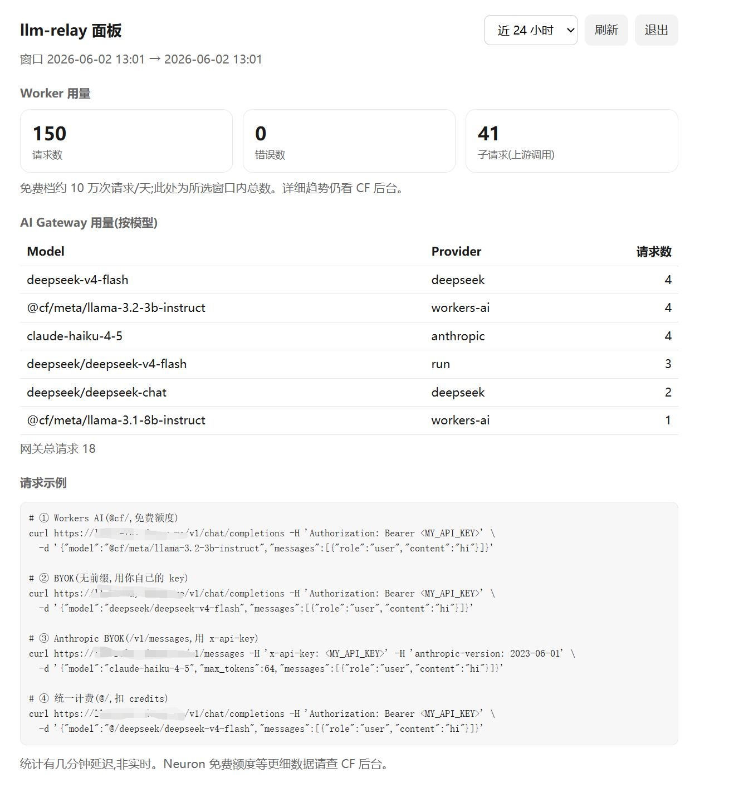
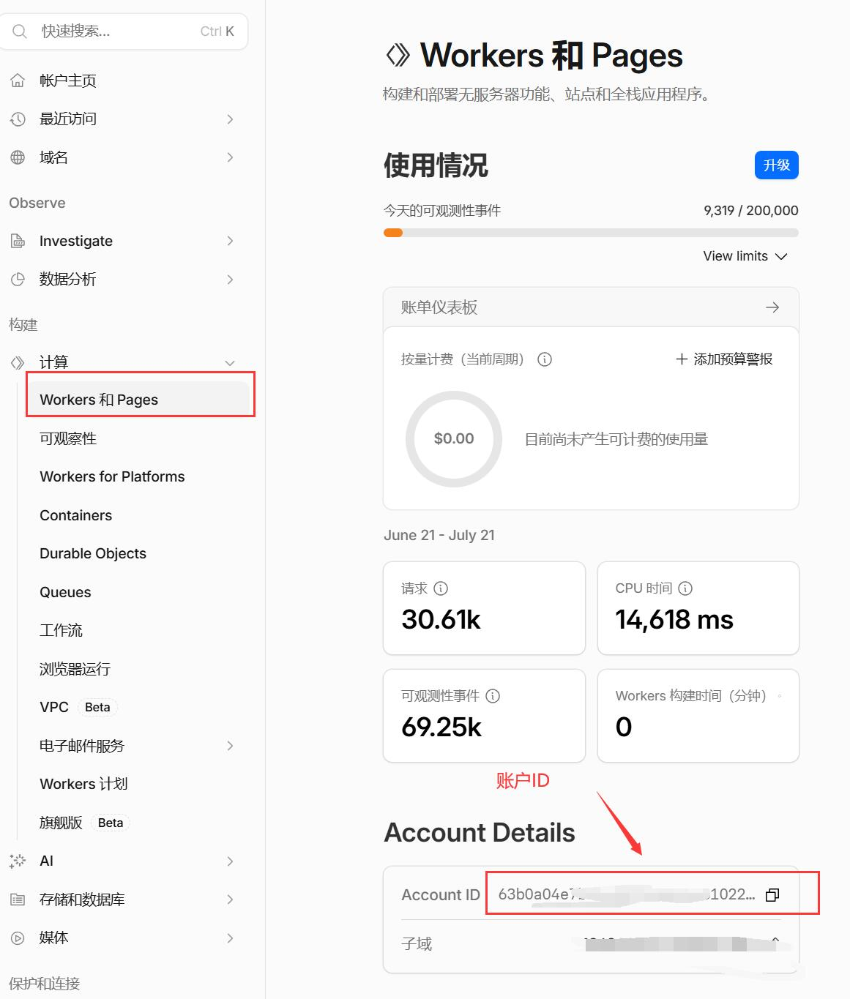
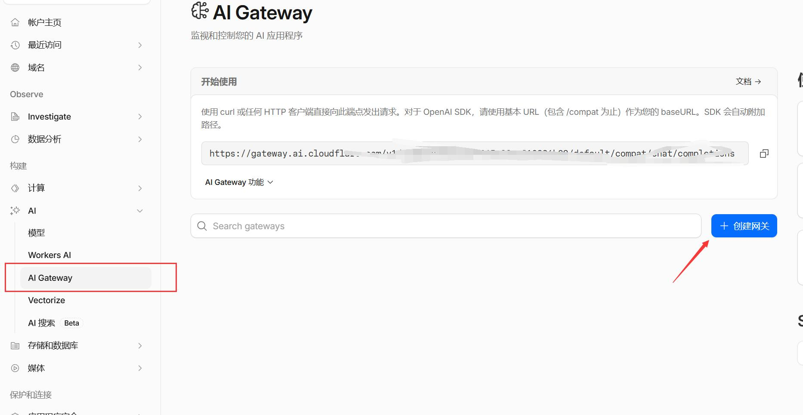
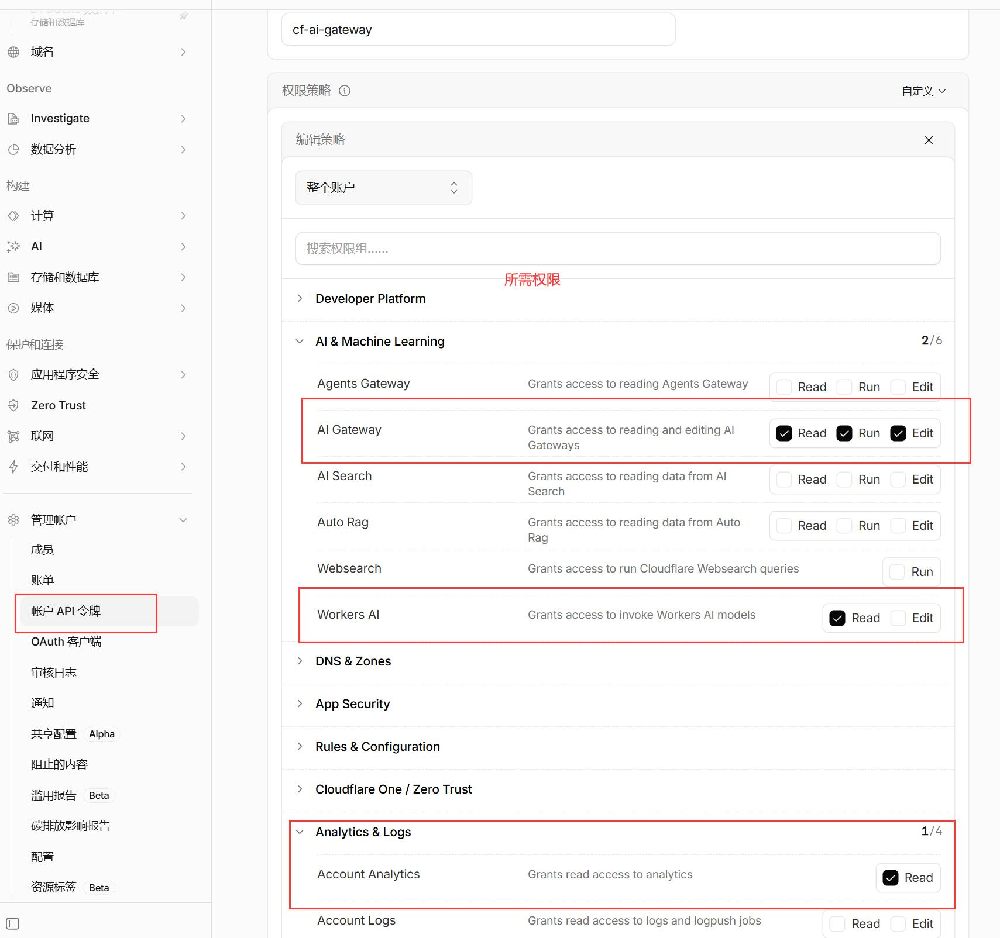

# llm-relay

`llm-relay` 是一个部署在 Cloudflare Workers 上的轻量级多路由 LLM 代理，所有流量均经过 Cloudflare AI Gateway。

## 项目简介

本项目对外同时暴露 **OpenAI 兼容** (`/v1/chat/completions`) 和 **Anthropic 兼容** (`/v1/messages`) 两个入口。通过 **“入口路径选格式 + model 名前缀选计费路由”** 的两层分流机制，支持在同一服务中混用三种计费/路由模式：
- **无前缀 (BYOK)**：使用自带的 Provider Key，不扣除 Credits。
- **`@cf/` 前缀**：使用 Workers AI 免费额度计价。
- **`@/` 前缀**：使用 Cloudflare Unified Billing 统一垫付计费，扣除 Credits。

该代理统一隐藏了 Cloudflare 账号凭证和各大模型提供商的 API Key，对外只要求使用一个你自定义的 API Key 进行鉴权，同时完整保留 AI Gateway 的请求日志、用量分析等可观测性功能。



> **详细说明：** 关于项目的核心架构、计费路由逻辑、环境变量说明以及各模型的调用示例，请务必查看最详细的项目说明文档：[`src/readme.md`](./src/readme.md)。

## 部署方式

项目的核心代码 (`worker.js`) 和配置文件 (`wrangler.toml`) 都存放在 `src/` 目录下。因此，所有的部署命令都必须在该目录下执行。请确保本地已安装 Node.js (≥ 18)。

### 1. 进入配置目录

```bash
cd src
```

### 2. 登录 Cloudflare

通过 Wrangler 进行交互式登录（如果已在 CI 环境可使用环境变量配置）：

```bash
npx wrangler login
```

### 3. 配置非敏感变量

编辑 `src/wrangler.toml` 文件，填写你的 Cloudflare 配置：
- `ACCOUNT_ID`：你的 Cloudflare 账号 ID
  
- `GATEWAY`：你在 Cloudflare AI Gateway 中创建的网关名称
  

### 4. 注入敏感密钥 (Secrets)

运行以下命令，将密码等敏感信息安全地注入到 Cloudflare。其中 Cloudflare API Token 必须包含 `AI Gateway Run` 和 `Workers AI Read` 权限，权限勾选示例如下：



```bash
# 1. 注入你自定义的对外分发 API Key
npx wrangler secret put MY_API_KEY

# 2. 注入 Cloudflare API Token
npx wrangler secret put CF_API_TOKEN

# 3. 注入管理员密码
npx wrangler secret put ADMIN_PASSWORD
```
*(注：如果需要专门为 Anthropic 补发 key，可按需注入 `ANTHROPIC_API_KEY`，详情见详细文档)*

### 5. 部署到线上

执行以下命令将代码和配置发布到 Cloudflare Workers：

```bash
npx wrangler deploy
```

部署完成后，控制台将输出你的 Worker 线上地址（例如：`https://llm-relay.<your-subdomain>.workers.dev`），部署即告完成。

> **⚠️ 网络连通性提示：** Cloudflare Workers 默认分配的 `*.workers.dev` 域名在部分地区（如中国大陆）可能存在被墙或网络不稳定的情况。为了确保服务在国内环境下的稳定访问，强烈建议在 Cloudflare Dashboard 中为该 Worker **绑定你自己的自定义域名**。

---

> 遇到问题或需要查阅具体的 API 请求示例（如 cURL、Python SDK 接入等），请参考 [详细文档 (`src/readme.md`)](./src/readme.md)。
